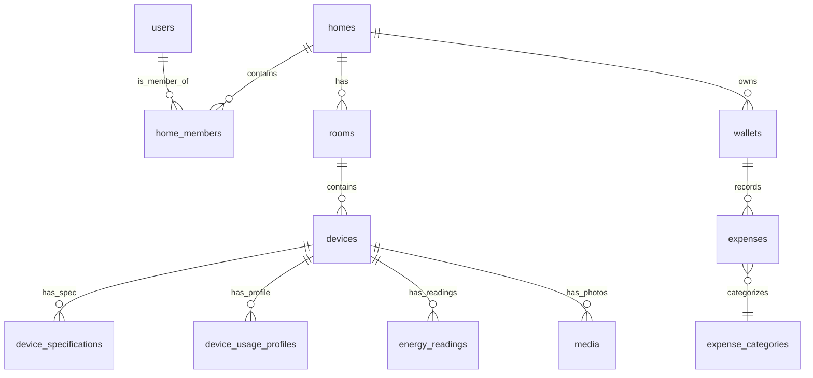
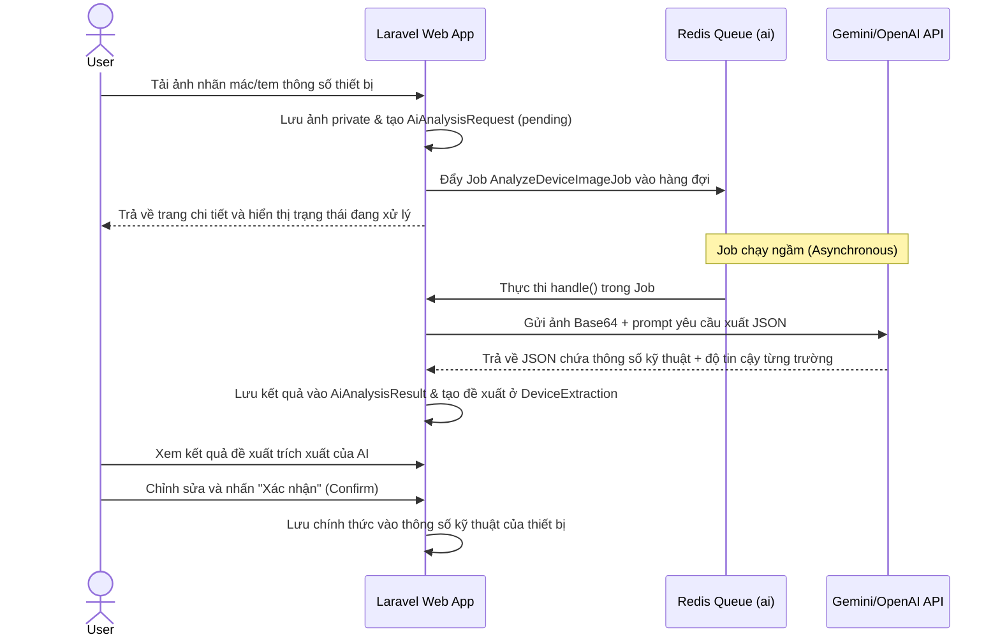

# HomeWatt

Ứng dụng quản lý thiết bị điện gia đình — chụp ảnh, AI trích xuất thông số, đo
và ước tính điện năng tiêu thụ, dự báo chi phí hàng tháng theo biểu giá điện.

## Tech Stack

| Lớp | Công nghệ |
| --- | --- |
| Backend | PHP 8.4, Laravel 12 |
| Kiến trúc | Modular monolith ([nwidart/laravel-modules](https://github.com/nwidart/laravel-modules)) |
| Frontend | Blade, Alpine.js, Tailwind CSS, Vite |
| Database | MySQL 8 |
| Cache / Queue | Redis 7 |
| Web server | Nginx + PHP-FPM |
| AI | Provider-agnostic (OpenAI Vision, Gemini, v.v.) |
| CI/CD | GitHub Actions, self-hosted runner |

## Yêu cầu cục bộ

- PHP 8.4 + Composer
- Node.js 22 + npm
- MySQL 8 hoặc Docker
- Redis (tùy chọn khi dùng Docker)

## Cài đặt cục bộ (không Docker)

```bash
cp .env.example .env
# Sửa DB_HOST=127.0.0.1, DB_PORT=3306, REDIS_HOST=127.0.0.1 trong .env

composer install
php artisan key:generate
php artisan migrate --seed
npm ci
npm run dev
```

Chạy queue worker cho AI analysis:

```bash
php artisan queue:work redis --queue=default
php artisan queue:work redis --queue=ai --sleep=5 --tries=3 --timeout=180
```

Truy cập http://localhost:8087 (nếu dùng artisan serve) hoặc port được cấu hình.

## Docker (development)

```bash
cp .env.example .env
# Giữ nguyên DB_HOST=db, REDIS_HOST=redis — container giao tiếp nội bộ

docker compose up -d --wait
docker compose exec app php artisan key:generate
docker compose exec app php artisan migrate --seed
```

Port mapping:

| Service | Host | Container |
| --- | ---: | ---: |
| Nginx | `8087` | `80` |
| MySQL | `3311` | `3306` |
| Redis | `6384` | `6379` |

## Docker (production)

Production image là multi-stage build, không mount source code từ host:

```bash
# Build
APP_IMAGE_TAG=$(git rev-parse --short=12 HEAD)
docker compose build --pull app nginx

# Deploy
docker compose up -d --wait db redis
docker compose run --rm --no-deps app php artisan migrate --force --no-interaction
docker compose up -d --force-recreate app queue queue-ai scheduler nginx
```

Hoặc push lên `master` — GitHub Actions trên self-hosted runner sẽ tự động deploy.

## CI/CD

Hai workflow chạy trên GitHub Actions:

| Workflow | Kích hoạt | Mô tả |
| --- | --- | --- |
| `ci.yml` | Push `develop`, PR vào `master`, hoặc chạy thủ công | Lint (Pint), audit, test |
| `deploy.yml` | Push `master` | Test → build image → deploy production → smoke test → rollback nếu lỗi |

Deploy production: self-hosted runner checkout code tại
`/home/minhnv/projects/homeWatt`, build multi-stage Docker image, chạy
migration, recreate container, đợi healthy, smoke test. Nếu thất bại tự động
rollback về image cũ.

### Secrets và variables cần cấu hình

| Name | Loại | Mô tả |
| --- | --- | --- |
| `TELEGRAM_BOT_TOKEN` | Secret | Bot token để gửi thông báo deploy |
| `TELEGRAM_DEPLOY_CHAT_ID` | Secret | Chat ID nhận thông báo |
| `PROJECT_DIR` | Variable | Đường dẫn checkout trên server (mặc định `/home/minhnv/projects/homeWatt`) |
| `PRODUCTION_URL` | Variable | URL production để smoke test (mặc định `http://localhost:8087`) |

## Kiến trúc module & Cơ sở dữ liệu

```
Modules/
├── Core/         Shared UI, health/version, application support
├── Home/         Nhà, thành viên, vai trò, phân quyền
├── Room/         Phòng và nhóm không gian trong nhà
├── Device/       Danh mục thiết bị, loại thiết bị, thông số kỹ thuật
├── Media/        Ảnh riêng tư, metadata, phân quyền, vòng đời
├── AI/           Vision provider, phân tích ảnh, schema trích xuất, usage/cost
├── Energy/       Hồ sơ sử dụng, chỉ số, ước tính, phương pháp tính
├── Tariff/       Biểu giá versioned, bậc giá, thuế, ngày hiệu lực
├── Dashboard/    Tổng hợp, biểu đồ, xếp hạng, chỉ báo chất lượng dữ liệu
├── Admin/        Dữ liệu tham chiếu, biểu giá, quản lý AI usage
├── Wallet/       Quản lý ví tài chính gia đình
└── Expense/      Quản lý thu chi và luân chuyển giao dịch ví
```

Mỗi module sở hữu routes, controllers, requests, policies, services, models, migrations, views, tests, config, và README riêng cho capability của nó. Cross-module access thông qua public contracts, actions, services, events, jobs, hoặc models.

### Sơ đồ quan hệ cơ sở dữ liệu (Database Schema)

Dữ liệu được tổ chức chặt chẽ và cô lập theo hộ gia đình (`home_id`):



---

## Các luồng nghiệp vụ cốt lõi

### 1. Luồng tự động trích xuất tem thông số thiết bị bằng AI Vision
Người dùng có thể chụp hoặc tải ảnh nhãn năng lượng/tem công suất thiết bị để AI trích xuất thông tin tự động:



> **Nguyên tắc an toàn AI**: Kết quả của AI chỉ là đề xuất và được lưu ở bảng `device_extractions` dưới trạng thái `pending`. Chỉ khi người dùng bấm xác nhận (`confirmed`), dữ liệu mới được đồng bộ vào bảng chính thức (`device_specifications`, `devices`).

### 2. Cơ chế ước lượng điện năng (Energy Engine)
Hệ thống tính toán lượng điện tiêu thụ hàng tháng của mỗi thiết bị dựa trên cấu hình tại lớp `EnergyCalculator`:
*   **Tải liên tục (Continuous)**:
    $$\text{kWh/tháng} = \frac{\text{Công suất định mức (W)} \times \text{Số giờ sử dụng/ngày} \times \text{Số ngày sử dụng/tháng}}{1000}$$
*   **Chu kỳ tải (Duty-cycle)**: Áp dụng cho điều hòa, tủ lạnh, bình nóng lạnh.
    $$\text{kWh/tháng} = \frac{\text{Công suất định mức (W)} \times \text{Số giờ sử dụng/ngày} \times \text{Số ngày sử dụng/tháng} \times \text{Duty Cycle}}{1000}$$
*   **Đo đạc thực tế (Measured)**: Nếu có dữ liệu từ ổ cắm thông minh hoặc công tơ đo điện (`energy_readings`), hệ thống ưu tiên **cộng tổng số đo thực tế** thay vì dùng công thức ước lượng.

### 3. Công cụ tính hóa đơn điện lũy tiến bậc thang (EVN)
Tính tiền điện dựa theo biểu giá lũy tiến 6 bậc thang của EVN được lưu trong database (`tariff_tiers`):
*   **Bậc 1**: 0 - 50 kWh (đơn giá 1,806 VND/kWh) + 10% VAT.
*   **Bậc 2**: 51 - 100 kWh (đơn giá 1,866 VND/kWh) + 10% VAT.
*   **Bậc 3**: 101 - 200 kWh (đơn giá 2,167 VND/kWh) + 10% VAT.
*   **Bậc 4**: 201 - 300 kWh (đơn giá 2,729 VND/kWh) + 10% VAT.
*   **Bậc 5**: 301 - 400 kWh (đơn giá 3,050 VND/kWh) + 10% VAT.
*   **Bậc 6**: Từ 401 kWh trở lên (đơn giá 3,151 VND/kWh) + 10% VAT.

### 4. Nghiệp vụ tài chính & Luân chuyển ví (Wallet & Transfers)
Nghiệp vụ chi tiêu được thiết kế tuân thủ tính nhất quán giao dịch (ACID):
*   Khi luân chuyển tiền giữa các ví (`transfers`), hệ thống tự động khóa ví nguồn và ví đích (`lockForUpdate()`) theo thứ tự ID để tránh deadlock.
*   Kiểm tra số dư khả dụng (gồm cả tiền chuyển và phí luân chuyển).
*   Tạo bản ghi giao dịch luân chuyển và đồng thời sinh tự động **2 giao dịch đối ứng** trong bảng `expenses` (ví nguồn ghi nhận Chi "Chuyển tiền ra", ví đích ghi nhận Thu "Chuyển tiền vào") liên kết tới `transfer_id`.
*   Hỗ trợ chức năng đảo ngược luân chuyển (`reverseTransfer`) để hoàn trả tiền và xóa mềm các giao dịch chi tiêu đối ứng một cách đồng bộ.

### 5. Dashboard & Caching hiệu năng
*   Sử dụng **Redis Cache** để cache kết quả Dashboard của từng nhà (`5 phút`) nhằm tránh thực thi các câu lệnh truy vấn SQL phức tạp liên tục. Cache tự động xóa khi có biến động thiết bị hoặc giao dịch.
*   Bộ đề xuất tiết kiệm điện (`SavingSuggestion`) phân tích dữ liệu thiết bị để đề xuất giảm giờ dùng cho thiết bị công suất cao, tối ưu cài đặt nhiệt độ điều hòa vào mùa nóng cao điểm (tháng 6-8), cảnh báo nếu tổng điện năng vượt ngưỡng giới hạn của căn nhà.


## Health check

Endpoints công khai:

| Endpoint | Mục đích |
| --- | --- |
| `GET /up` | Application health — trả về `{"status":"ok"}` |
| `GET /version` | Release identity — trả về `{"release":"<git-sha>"}`, `Cache-Control: no-store` |

## Deployment verification

Sau deploy, smoke test tự động kiểm tra:

1. `/up` trả về HTTP 200
2. `/version` khớp với commit SHA được deploy, response có `Cache-Control: no-store`
3. `/login` trả về HTML hợp lệ
4. Ít nhất một asset Vite (`/build/assets/*.css` hoặc `*.js`) được load

Rollback: workflow giữ lại image production hiện tại trước khi deploy. Nếu
healthcheck hoặc smoke test thất bại, image cũ được retag và container được
recreate.

## Quy ước kỹ thuật

- **Photos are private by default** — ảnh được serve qua authorized controller hoặc signed URL.
- **AI proposes, user confirms** — output AI không ghi đè trực tiếp dữ liệu đã xác nhận.
- **Measured ≠ Estimated** — dữ liệu đo và ước tính luôn được phân biệt rõ ràng.
- **Tariffs are versioned data** — không hardcode giá điện.
- **Home-level isolation** — mọi resource đều được scope theo `home_id` và kiểm tra membership.

Xem chi tiết tại [`agent.md`](agent.md) và [`HOMEWATT_IMPLEMENTATION_PLAN.md`](HOMEWATT_IMPLEMENTATION_PLAN.md).

## License

Dự án nội bộ. Mã nguồn thuộc quyền sở hữu của tác giả.
