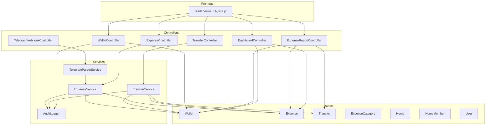

# 🔍 BA & Technical Review — homeWatt Finance System

> **Ngày review**: 2026-06-27
> **Reviewer**: BA & Technical Reviewer
> **Phạm vi**: Wallet, Expense, Transfer, Dashboard, Telegram, Audit, Core modules.

---

## Tổng quan kiến trúc hiện tại



---

## Trạng thái tổng hợp

| Module | Files Reviewed | Critical | High | Medium | Trạng thái |
|--------|:-:|:-:|:-:|:-:|:--|
| **Wallet** | 6 | 1 | 3 | 3 | 🔴 Có lỗi nghiêm trọng |
| **Expense** | 11 | 4 | 5 | 4 | 🔴 Có lỗi nghiêm trọng |
| **Dashboard** | 1 | 0 | 2 | 2 | ⚠️ Cần cải thiện |
| **Telegram** | 2 | 2 | 3 | 1 | 🔴 Có lỗi bảo mật |
| **Core/Auth** | 5 | 1 | 2 | 3 | ⚠️ Cần cải thiện |
| **Audit** | 1 | 0 | 1 | 2 | ⚠️ Cần tối ưu |
| **TỔNG** | **26** | **8** | **16** | **15** | |

---

## 🔴 CRITICAL — Lỗi Nghiêm Trọng (Cần sửa ngay)

### C1. `Wallet::restore()` ghi đè `SoftDeletes::restore()` — mất khả năng phục hồi ví

**File**: `Modules/Wallet/app/Models/Wallet.php`

Model sử dụng `SoftDeletes` trait, nhưng method `restore()` tự định nghĩa chỉ set `is_archived = false`. Kết quả: **không thể phục hồi ví đã xóa mềm**.

```diff
-public function restore(): bool { return $this->forceFill(['is_archived' => false])->save(); }
+public function unarchive(): bool { return $this->forceFill(['is_archived' => false])->save(); }
```

> ⚠️ Controller `restore()` route đang gọi method này — sẽ cần rename route handler tương ứng.

---

### C2. Race condition trong `ExpenseService::updateExpense()` — ví cũ không lock

**File**: `Modules/Expense/app/Services/ExpenseService.php`

Khi sửa giao dịch có thay đổi ví, ví cũ được load **không có lock**, ví mới thì có lock. Hai request đồng thời trên cùng ví cũ → balance sai.

```diff
 // HIỆN TẠI (SAI):
-$oldWallet = $locked->wallet;                               // ❌ No lock!
-$newWallet = Wallet::lockForUpdate()->find($locked->wallet_id);
 
 // SỬA: Lock TẤT CẢ wallets liên quan theo thứ tự ID (tránh deadlock)
+$walletIds = collect([$locked->getOriginal('wallet_id'), $validated['wallet_id']])
+    ->unique()->sort()->values();
+$lockedWallets = Wallet::whereIn('id', $walletIds)->lockForUpdate()->get()->keyBy('id');
```

---

### C3. Transfer fee KHÔNG được tính trong `calculatedBalance()` — balance drift

**Files**: `Modules/Wallet/app/Models/Wallet.php` + `Modules/Expense/app/Services/TransferService.php`

| Nơi | Cách tính | Có tính fee? |
|-----|-----------|:---:|
| `TransferService` → cached balance | `$from->balance - ($amount + $fee)` | ✅ |
| `Wallet::calculatedBalance()` | `Transfer::sum('amount')` | ❌ |

**Hậu quả**: Mỗi transfer có `fee > 0` sẽ gây chênh lệch giữa `balance` (cached) và `calculatedBalance()`. Càng nhiều transfer có fee → càng sai nhiều. Hàm `refreshBalance()` sẽ **ghi đè balance đúng bằng giá trị sai**.

```diff
 // Wallet::calculatedBalance()
-$transferOut = (float) Transfer::where('from_wallet_id', $this->id)->whereNull('deleted_at')->sum('amount');
+$transferOut = (float) Transfer::where('from_wallet_id', $this->id)->whereNull('deleted_at')
+    ->selectRaw('SUM(amount + fee) as total')->value('total') ?? 0;
```

---

### C4. Audit log ghi trùng — cả Service LẪN Controller đều log

**Files**: `ExpenseService.php`, `ExpenseController.php`, `TransferService.php`, `TransferController.php`

Mỗi giao dịch tạo/sửa/xóa đều ghi **2 audit log entries** giống nhau vì cả Service và Controller đều gọi `AuditLogger::log()`.

**Giải pháp**: Chỉ log ở Service layer (nơi business logic thực sự xảy ra). Xóa log ở Controllers.

---

### C5. Telegram webhook không xác thực — ai cũng có thể tạo giao dịch

**File**: `Modules/Expense/app/Http/Controllers/TelegramWebhookController.php`

Endpoint `/api/telegram/webhook` không verify request từ Telegram. Attacker có thể POST fake message → tạo expense bất kỳ.

```diff
+// Verify Telegram secret token
+if ($request->header('X-Telegram-Bot-Api-Secret-Token') !== config('services.telegram.webhook_secret')) {
+    abort(403, 'Invalid webhook token');
+}
```

---

### C6. `TelegramParserService` có thể trả `category_id = null` → crash DB

**File**: `Modules/Expense/app/Services/TelegramParserService.php`

Khi không match được category, `$category` là `null`, nhưng `expenses.category_id` là NOT NULL FK → DB exception.

```diff
+if (!$category) {
+    $category = ExpenseCategory::where('home_id', $homeId)
+        ->where('is_system', true)
+        ->where('name', 'LIKE', '%Khác%')
+        ->first();
+    if (!$category) {
+        throw new \RuntimeException('Không tìm thấy danh mục mặc định');
+    }
+}
```

---

### C7. `buildCategoryReport()` bao gồm bản ghi đã soft-delete

**File**: `Modules/Expense/app/Http/Controllers/ExpenseReportController.php`

Sử dụng `DB::table('expenses')` thay vì Eloquent → bypass SoftDeletes → báo cáo tính cả giao dịch đã xóa.

```diff
 $query = DB::table('expenses')
     ->join('expense_categories', 'expenses.category_id', '=', 'expense_categories.id')
+    ->whereNull('expenses.deleted_at')
```

---

### C8. `TransferController::destroy` dùng quyền `'view'` thay vì `'delete'`

**File**: `Modules/Expense/app/Http/Controllers/TransferController.php`

```diff
-$this->authorize('view', $transfer);
+$this->authorize('delete', $transfer);
```

Bất kỳ member nào có quyền xem đều có thể xóa/reverse transfer — lỗi bảo mật nghiêm trọng.

---

## ⚠️ HIGH — Lỗi Logic Quan Trọng

### H1. Credit card có thể "gửi tiền" qua Transfer

**File**: `Modules/Expense/app/Services/TransferService.php`

Thẻ tín dụng chỉ nên **nhận** (trả nợ), không nên là ví nguồn chuyển khoản.

```diff
// TransferService::createTransfer()
+if ($from->type === 'credit_card') {
+    throw new \RuntimeException('Không thể chuyển tiền từ thẻ tín dụng.');
+}
```

---

### H2. Dashboard income/expense chưa loại trừ giao dịch vay nợ

**File**: `Modules/Dashboard/app/Http/Controllers/DashboardController.php`

`monthly_income` và `monthly_expense` trên Dashboard bao gồm Cho vay/Đi vay, nhưng Báo cáo tháng đã loại trừ → **số liệu không khớp**.

---

### H3. `balance` nằm trong `$fillable` — cho phép mass-assignment

**File**: `Modules/Wallet/app/Models/Wallet.php`

`balance` là trường computed, không nên cho phép gán từ form/request. Cần xóa khỏi `$fillable`.

---

### H4. `canDelete()` dùng strict float comparison `=== 0.0`

**File**: `Modules/Wallet/app/Models/Wallet.php`

Float comparison không đáng tin cậy. Balance `0.000000001` (từ rounding) sẽ chặn xóa ví.

```diff
-public function canDelete(): bool { return $this->calculatedBalance() === 0.0; }
+public function canDelete(): bool { return abs($this->calculatedBalance()) < 0.01; }
```

---

### H5. `destroy()` trong WalletController không wrap transaction

**File**: `Modules/Wallet/app/Http/Controllers/WalletController.php`

`canDelete()` check → `delete()` không trong cùng transaction + lock → race condition giữa check và delete.

---

### H6. ExpenseReportController không verify home_id authorization

**File**: `Modules/Expense/app/Http/Controllers/ExpenseReportController.php`

User có thể truyền `home_id` bất kỳ vào URL → xem báo cáo tài chính của home khác.

---

### H7. Multi-byte string bug trong TelegramParserService

**File**: `Modules/Expense/app/Services/TelegramParserService.php`

`strlen()` / `substr()` trên chuỗi UTF-8 Vietnamese → corrupt text. Cần dùng `mb_strlen()` / `mb_substr()`.

---

### H8. Debt categories dùng hardcoded Vietnamese strings

**Files**: ExpenseController, ExpenseReportController, TelegramParserService, Views

Nếu user đổi tên category → toàn bộ logic vay nợ hỏng. Nên thêm cột `category_group` vào bảng `expense_categories`.

---

### H9. N+1 queries trong monthly report — 62 queries/tháng

**File**: `Modules/Expense/app/Http/Controllers/ExpenseReportController.php`

Loop mỗi ngày × 2 queries. Cần gom thành 1 GROUP BY query.

---

### H10. StoreTransferRequest không validate 2 ví thuộc cùng Home

**File**: `Modules/Expense/app/Http/Requests/StoreTransferRequest.php`

---

### H11. Cross-home category injection trong StoreExpenseRequest

**File**: `Modules/Expense/app/Http/Requests/StoreExpenseRequest.php`

User có thể submit `category_id` thuộc home khác.

---

### H12. `telegram_verification_code` và `telegram_chat_id` mass-assignable

**File**: `app/Models/User.php`

Attacker có thể ghi đè verification code hoặc link Telegram của user khác.

---

## 📋 MEDIUM — Cải Thiện

| # | File | Vấn đề |
|---|------|--------|
| M1 | WalletController `show()` | Eager load ALL rồi query lại → bỏ `->load()` |
| M2 | WalletController `index()` | Không pagination khi có nhiều ví |
| M3 | Credit card formula | Lặp lại 4 nơi → tạo `Wallet::netBalance()` |
| M4 | AuditLogger | Thiếu index trên `action`, `user_id`, `created_at` |
| M5 | DashboardController `compare()` | Potential null collection crash `$summaries[$currentKey]` |
| M6 | Expense migrations | Thiếu composite index `(home_id, type, occurred_at)` |
| M7 | Transfer fee | Phí "biến mất" → nên ghi expense riêng |
| M8 | Telegram | Chỉ dùng home đầu tiên, không hỗ trợ multi-home |
| M9 | Telegram | Không rate limiting |
| M10 | `owner_id` mass-assignable | Home model cho phép gán `owner_id` từ request |
| M11 | Policy `create()` | Luôn return `true`, phụ thuộc hoàn toàn vào controller |
| M12 | HomeMember | `canEdit()` và `isEditor()` trùng logic |
| M13 | Transfer model | Thiếu `home()` relationship trực tiếp |
| M14 | `env()` fallback | TelegramWebhookController dùng `env()` thay vì chỉ `config()` |
| M15 | Amount auto-guess | Số < 1000 tự ×1000 → rủi ro sai |

---

## Kế Hoạch Sửa — 4 Phases

### Phase 1: 🔴 Critical Fixes (8 files)

| File | Sửa |
|------|-----|
| `Wallet.php` | Rename `restore()` → `unarchive()` (C1), fix `calculatedBalance()` tính fee (C3), xóa `balance` khỏi `$fillable` (H3), fix float comparison (H4), thêm `netBalance()` (M3) |
| `WalletController.php` | Gọi `unarchive()` (C1), wrap `destroy()` transaction (H5), bỏ eager load thừa (M1), dùng `netBalance()` (M3) |
| `ExpenseService.php` | Lock tất cả wallets (C2), xóa duplicate audit (C4) |
| `TransferService.php` | Block credit card source (H1), xóa duplicate audit (C4) |
| `TransferController.php` | Fix auth `'view'` → `'delete'` (C8) |
| `ExpenseReportController.php` | Fix soft-delete filter (C7), thêm home_id auth (H6), optimize queries (H9) |
| `TelegramWebhookController.php` | Thêm webhook verification (C5) |
| `TelegramParserService.php` | Fix null category (C6), fix mb_strlen (H7) |

### Phase 2: ⚠️ High Priority Fixes (5 files)

| File | Sửa |
|------|-----|
| `DashboardController.php` | Loại trừ debt categories (H2), dùng `netBalance()` (M3), fix null crash (M5) |
| `StoreTransferRequest.php` | Validate 2 ví cùng home (H10) |
| `StoreExpenseRequest.php` | Cross-validate category_id (H11) |
| `User.php` | Xóa telegram fields khỏi `$fillable` (H12) |
| `ExpenseController.php` | Xóa duplicate audit (C4) |

### Phase 3: 📋 Performance & Database

| Item | Mô tả |
|------|--------|
| Migration mới | Composite index `expenses(home_id, type, occurred_at, transfer_id)`, indexes trên `audit_logs` |
| `Home.php` | Xóa `owner_id` khỏi `$fillable` (M10) |

### Phase 4: 🔧 Enhancements (Future)

| Item | Mô tả |
|------|--------|
| Category group | Thêm cột `category_group` thay hardcoded strings (H8) |
| Transfer fee tracking | Tạo expense record riêng cho phí chuyển khoản (M7) |
| Telegram multi-home | Cho phép chọn home khi dùng Telegram (M8) |
| Rate limiting | Middleware throttle cho Telegram webhook (M9) |
| Audit cleanup | Rotation/archival cho audit_logs cũ |

---

## Open Questions

1. **Thẻ tín dụng có nên cho phép chi tiêu vượt hạn mức?**
   Hiện tại hệ thống cho phép balance vượt `opening_balance` (nợ quá hạn mức). Có muốn giới hạn?

2. **Phí chuyển khoản có nên tự động ghi nhận thành expense riêng?**
   Hiện tại fee "biến mất" khỏi hệ thống. Tạo expense riêng sẽ giúp đối soát nhưng thêm complexity.

3. **Debt categories có nên chuyển sang dùng `category_group` thay vì tên hardcode?**
   Đây là thay đổi migration + data, ảnh hưởng toàn bộ logic vay nợ. Nhưng sẽ robust hơn nhiều.
